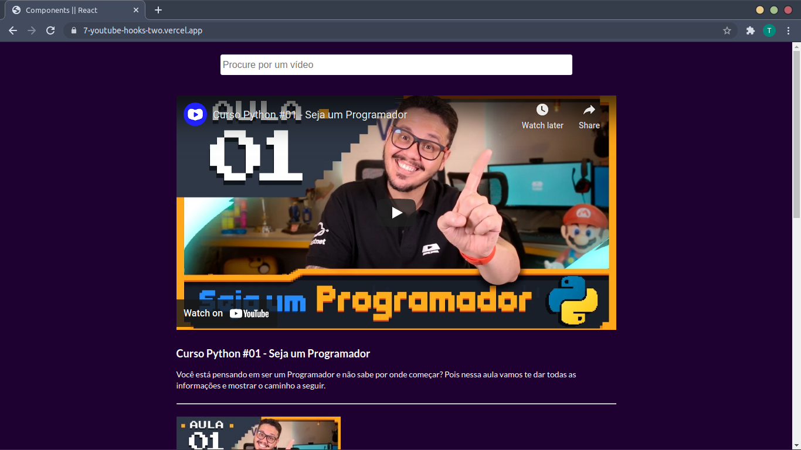
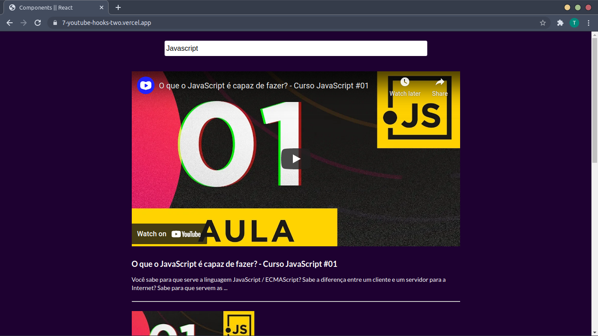
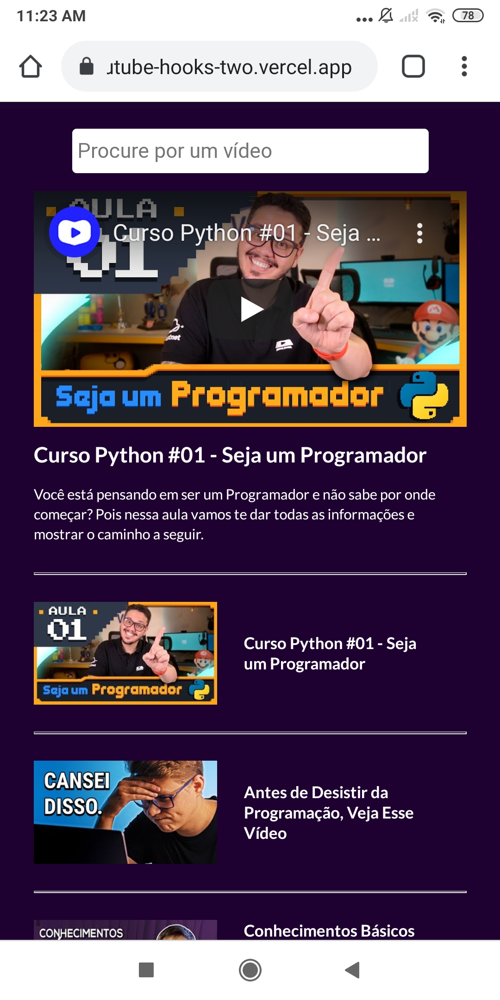

<h1><a href="https://7-youtube-hooks-two.vercel.app/" style="color: black;">🔗 YoutubeClone</a></h1>

Aplicação que se conecta com a API do Youtube e te permite pesquisar pelos seus vídeos e assistir na própria.

<h2>Tópicos</h2>

<ul>
  <li><a href="#screenshots" color="">Screenshots</a></li>
  <li><a href="#tecno" color="">Tecnologias</a></li>
  <li><a href="#sobre" color="">Autor</a></li>
</ul>

<h2 id="screenshots">Screenshots</h2>

Desktop - Inicialização

##### 

Desktop - Pesquisa Qualquer

##### 

Mobile - Inicialização

<h2 id="tecno">Tecnologias</h2>

1. Biblioteca ReactJS
2. API Youtube DATA v3
3. Axios 

<h2 id="sobre">Autor</h2>

Na data do repositório sou Thiago Juan e sou um programador FrontEnd de 16 anos com uma paixão imensa por desenvolvimento web no geral, tendo um sonho de um dia se tornar um ótimo Full-Stack. Se caso queira entrar em contato comigo, aqui vai redes alternativas:

[LinkedIn](https://www.linkedin.com/in/thiago-juan-4725771b4/)

[Instagram](https://www.instagram.com/tjuan.dev/) Aqui eu posto mais sobre o meu cotidiano como Desenvolvedor e ajudo a outras pessoas :)
